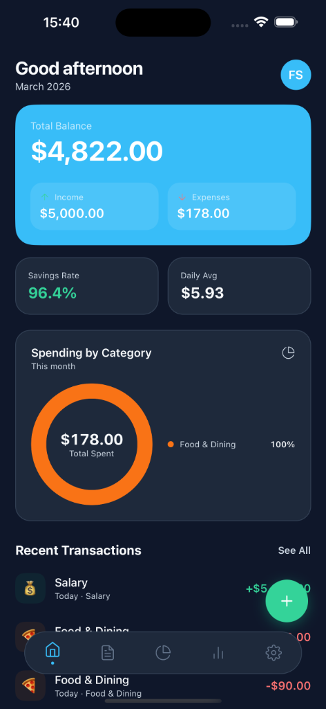
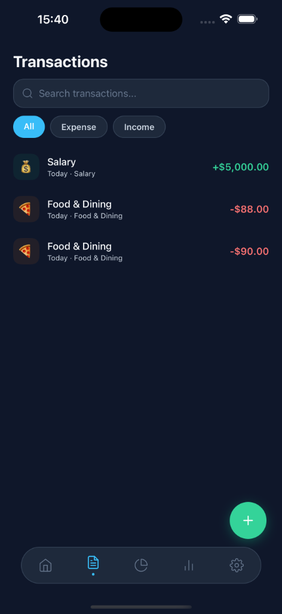
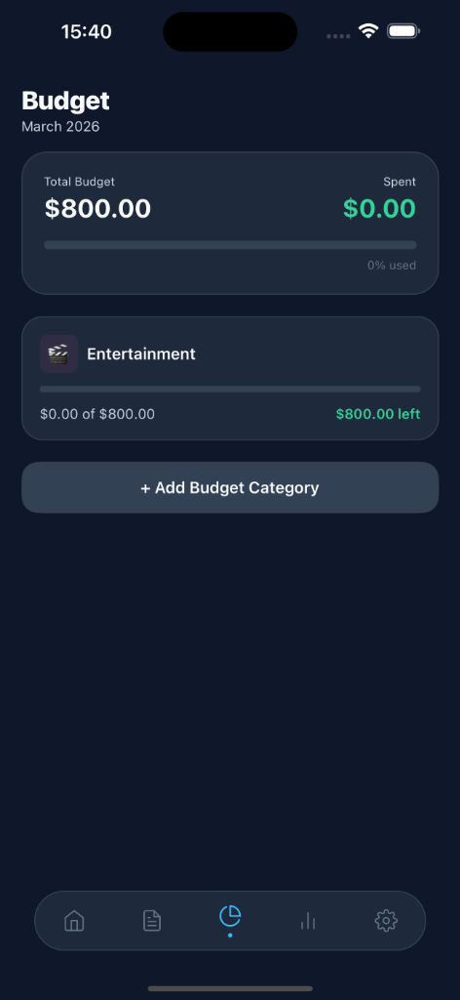
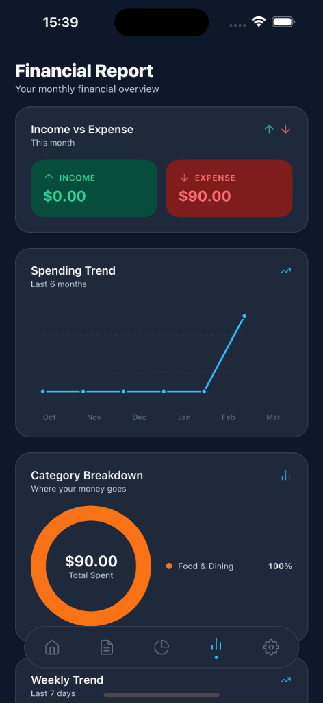
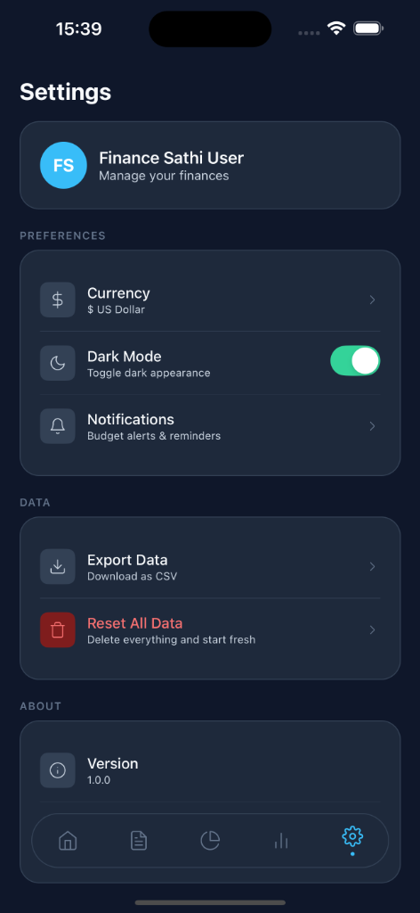

# Finanace-Sathi

Finanace-Sathi is a modern, intuitive personal finance management application designed to help you take control of your financial life. Track your spending, set budgets, and visualize your financial health with ease.

## ✨ Features

- **📊 Comprehensive Dashboard**: Get an immediate overview of your total balance, monthly income, and expenses.
- **💸 Transaction Tracking**: Log and categorize your daily expenses and income for precise record-keeping.
- **📅 Budget Management**: Set monthly spending limits for various categories to ensure you stay on track.
- **📈 Detailed Financial Reports**: Visualize your spending trends over time and see a breakdown of where your money goes.
- **🌙 Elegant UI with Dark Mode**: A premium, user-friendly interface that's easy on the eyes.

## 📱 App Screenshots

  <table border="0">
    <tr>
      <td width="33%"></td>
      <td width="33%"></td>
      <td width="33%"></td>
    </tr>
    <tr>
      <td align="center"><b>Dashboard</b></td>
      <td align="center"><b>Transactions</b></td>
      <td align="center"><b>Budgeting</b></td>
    </tr>
    <tr>
      <td width="33%"></td>
      <td width="33%"></td>
      <td width="33%"></td>
    </tr>
    <tr>
      <td align="center"><b>Financial Reports</b></td>
      <td align="center"><b>Settings</b></td>
      <td></td>
    </tr>
  </table>

## 🛠️ Tech Stack

- **Framework**: React Native / Expo
- **Icons**: Material Symbols / Lucide
- **Charts**: Victory Native / React Native Gifted Charts (implied by design)
- **Styling**: Vanilla CSS/Stylesheets with a focus on premium aesthetics

## 🚀 Getting Started

1. Clone the repository
2. Install dependencies: `npm install`
3. Start the project: `npx expo start`